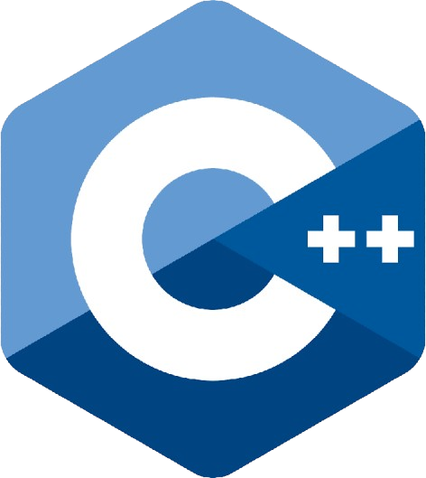

<h1 align="center">Hello, I'm engineer Emiliano.</h1>

<table>
  <tr>
    <td>
      
    </td>
  </tr>
</table>

<h1 align="center">about me:</h1>

I'm Emiliano, a cybersecurity engineer born in Saltillo, Coahuila, and currently living in Santa Fe, Mexico City, at the age of 20.
I'm passionate about programming, especially anything that involves solving problems and creating games that require logic and code.
I have a fun and playful personality; I don't take things too seriously... except when it's something I'm passionate about or my job, when I really give my all to achieve quality results.

<h1 align="center">Technologies I manage:</h1>

<table>
  <tr>
    <td>
        
    </td>
    <td>
        
    </td>
        <td>
        
    </td>
    <td>
        
    </td>
        <td>
        
    </td>
    <td>
        
    </td>
        <td>
        
    </td>
    <td>
        
    </td>
        <td>
        
    </td>
    <td>
        
    </td>
  </tr>
</table>
