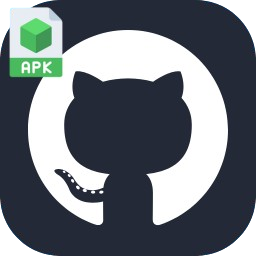

  

<h1 align="center">Hello, I'm engineer Emiliano.</h1> 

  
  

 
<h2>about me</h2>

  
### Engineer Emiliano Hernández Navarrete

Computer engineer. Cybersecurity specialist. Ethical Hacker working remotely.

About me
• Technical background in programming
• Computer Engineering degree from UNAM
• Master’s degree in Cybersecurity from UNITEC
• Remote Ethical Hacker at Sharck Offensive

Education
• Programming Technician. Vocational School 11
• Computer Engineering. UNAM. 2016
• Master’s Degree in Cybersecurity. UNITEC. 2019

Professional focus
• Penetration testing
• Vulnerability analysis
• Offensive security
• Application and system security review

This GitHub
• Programming projects
• Security scripts
• Cybersecurity practice work
• Code focused on system analysis and protection

Areas of interest
• Software development
• Offensive security
• Network security
• Ethical hacking

<h2 >Mastered technologies</h2>

 
    
    
    
    
    
    
    
    
    
    
    
    
    
    
    
    
    
    
    
    
    
    
    
    
    
    
    
    
    
    
    
    
    
    
    
    
    
    
    
    
    
    
    

 

<h2 >Repositories</h2>

  
  
   

<h2>university degrees</h2>

  

