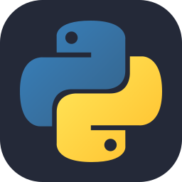
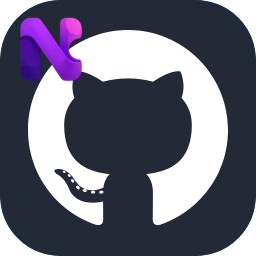
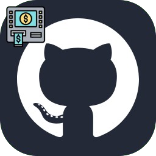
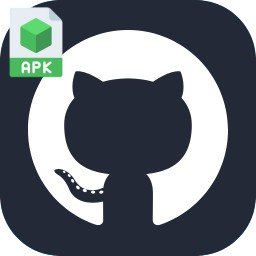

  

<h1 align="center">Hi, I'm h3rnix.</h1> 

  </a>
  

 
<h2>about me</h2>

Hi, I'm Emiliano Hernández Navarrete. I'm a 15-year-old high school student at CETIS No. 01 "Coronel Matilde Galicia Rioja." I'm passionate about programming and aspire to become an ethical hacker. My interest in technology really took off at the *Escuela Mexicana de Computación e Informática Avanzada*, where I earned a certification as a microcomputer operator.

That experience sparked my interest in tech, specifically Red Teaming—focusing on offensive security and attacking systems ethically. From there, I taught myself how to use Kali Linux, which opened the door to everything I know today. Along the way, I learned programming languages like C, C++, C#, Python, and Java, as well as basic web development (HTML, CSS, and JavaScript).

Rather than sticking to standard web development like most people, I was drawn to penetration testing, phishing simulations, and offensive security techniques. I've created several repositories to showcase everything I've learned and built.

<h2 >Currently Learning & Exploring</h2>

 
    
    
    
    
    
    
    
    
    
    
    
    
    
    
    
    
    
    

 

<h2 >Repositories</h2>

  
  
   

  
  

  

